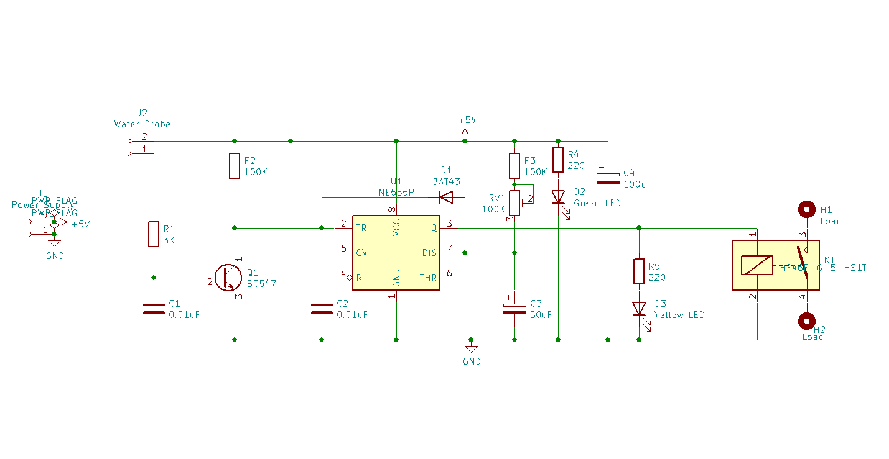
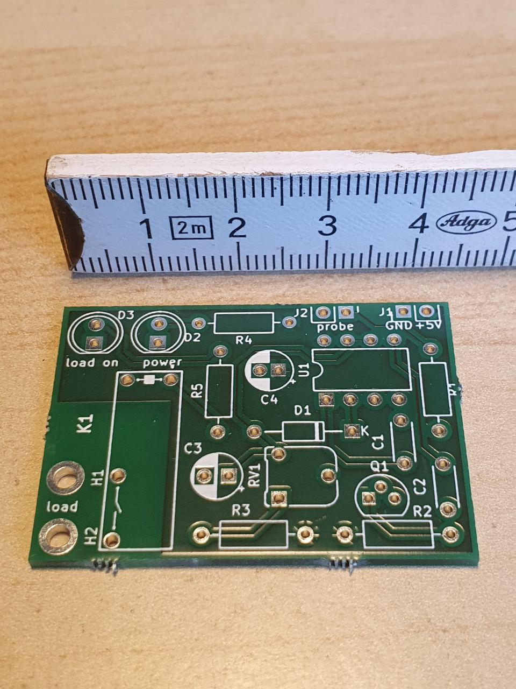
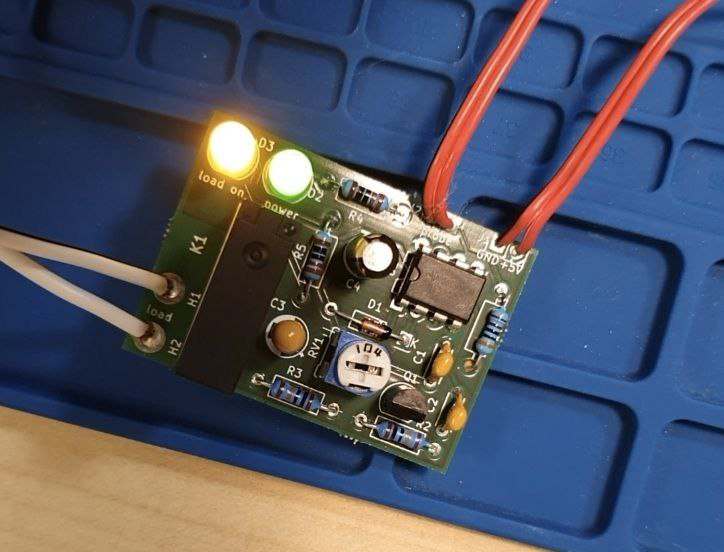

# sewage_pump_controller
Electronic controller for sewage pump. Elektronische Steuerung für Abwasserpumpe.

This project implements a simple sewage pump controller.

The project is created using the KiCAD tool.

The advantages of the schematic is the simplicity and that the only one probe is necessary.
The disadvantage is that you need to detect the time the pump needs to emptify the sewage container and then setup this time using the trim pot RV1.

The time formula is 1.1(R3+RV1)C3 and is currently from 5 to 10 sec.
If you need longer time feel free to incerase R3 or RV1 or C3.
If you need shorter time pay attention that the R3 shall not be decreased as otherwise the Q1 which is connected over D1 will stop working in key mode.
Instead just decrease the C3. 

